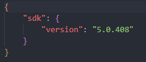
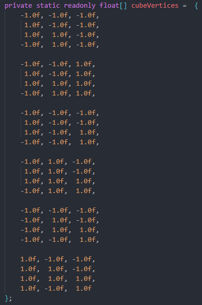
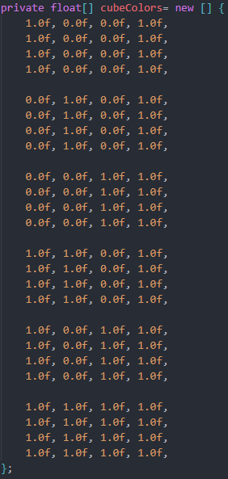
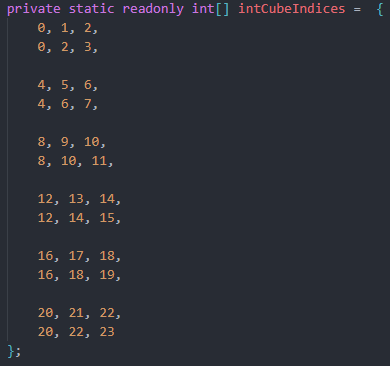
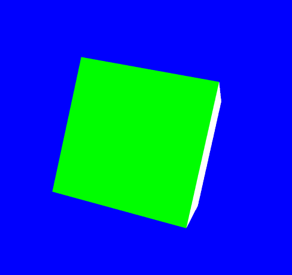

# Making a rotating cube with Blazor.
In this activity we need to modify the given sample project which has a rotating cube in a way so that every face of the cube is rendered using a different solid color.

We have to use .NET 5.0, so a file was created to correctly tell the compiler to use said version.

To complete the project with what is requested, modifying the array of the vertices and the array of the colors is enough. To remove the interpolation between all the different colors, what is needed is to specify for each vertex to have a solid color for all four points of a face of the cube. To do this, it is necessary to define the corners vertices three different times, with three different colors.

Since the number of vertices has incremented, it is also a must to modify the indexes array.

The result is the following.

